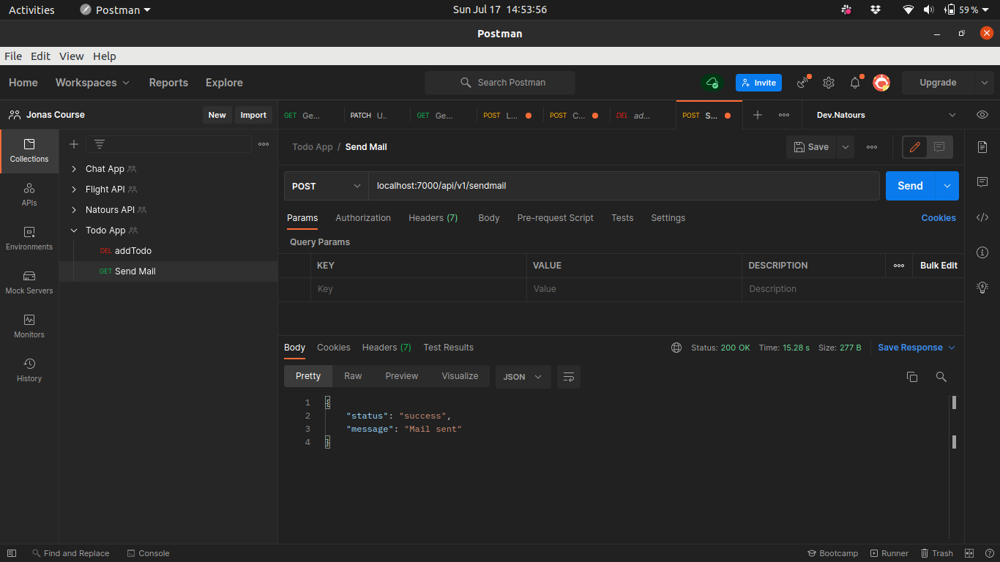
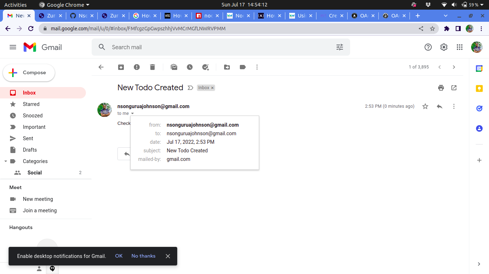
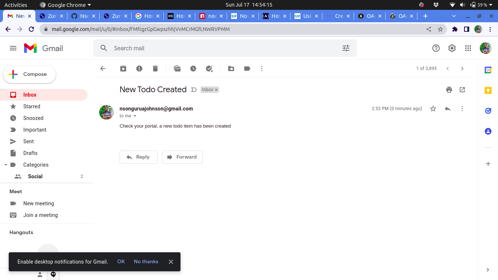

# I4GZURI-EmailSender

This app sends mail(s) to the user's(my) gmail from the nodemailer application.
To test it out hit the end point: _localhost:7000/api/v1/sendmail_

The images below are the results

